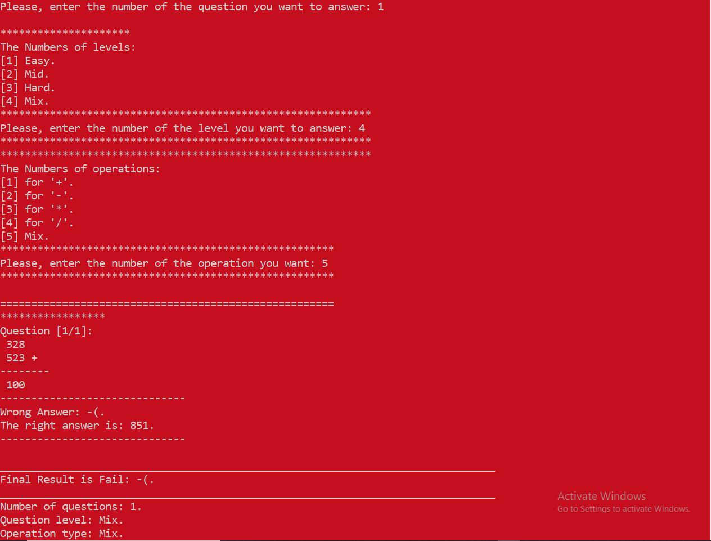

# Math Quiz Game in C++

A console-based **Math Quiz** game written in C++ with multiple difficulty levels and operation types.

## Features
- Multiple difficulty levels (Easy, Medium, Hard, Mix)
- Different operation types (+, -, *, /, Mixture)
- Score tracking (correct/incorrect answers)
- Colorful console feedback
- Sound effects for correct/wrong answers

## How to Play
1. Clone the repository:
```bash
git clone https://github.com/AbdulrahmanFrontend/math-quiz-cpp.git
```
2. Open in Visual Studio:
    - Double-click math-quiz-cpp.sln, OR
    - In VS: File → Open → Project/Solution → Select .sln file
3. Build & Run:
    - Press Ctrl + F5 (Run without debug) or F5 (Debug mode)

## Game Options
- **Difficulty Levels**:
  - Easy (1-9)
  - Medium (10-99)
  - Hard (100-999)
  - Mix (random)

- **Operation Types**:
  - Addition (+)
  - Subtraction (-)
  - Multiplication (*)
  - Division (/)
  - Mixture (random operations)

## Screenshot


## Contribution
Feel free to contribute by forking the repository and submitting pull requests!
